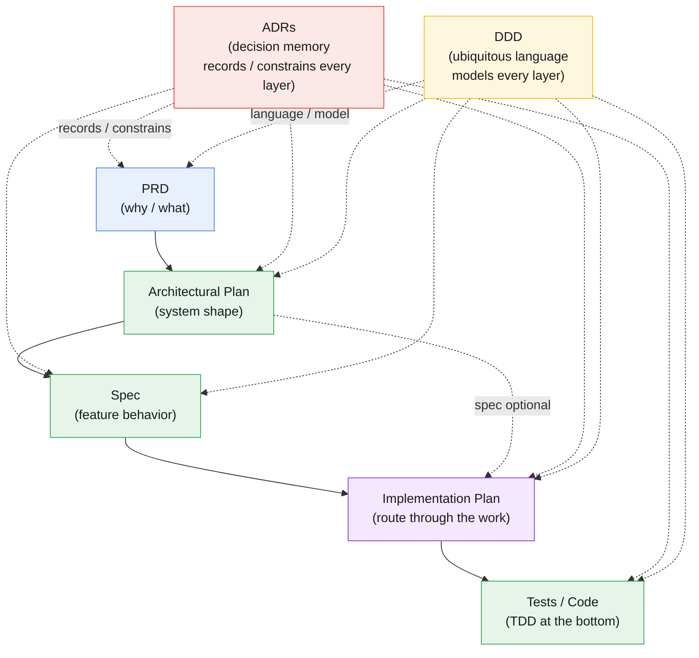

# Development Document Flow

A one-page map of how the planning artifacts stack, from product intent down to running code. 



Each layer normally takes the one above it as fixed context and adds precision. Spec is optional when the architectural plan already gives enough direction to move straight into implementation planning. A decision settled upstream is not re-argued downstream.

---

## Process Summaries

### **PRD — *why / what***

Defines the problem, who has it, and why it is worth solving. Captures goals, success metrics, user stories, scope boundaries, and priorities. Deliberately implementation-agnostic: it names the outcome to achieve, not the technology to use. Owned by product; read by everyone. One PRD can spawn several specs.

Repo shape:
```text
docs/
├── prd.md
└── feature-<feature-name>/
    └── prd.md

```

### **Architectural Plan — *system shape***

Establishes the high-level structure and the decisions that are expensive to reverse: component decomposition, boundaries, datastore choices, sync vs. async, scaling and failure modes, security posture. Takes the PRD as its target and commits to a system skeleton that everything below inherits. The defining trait: these are the choices you would be reluctant to undo.

Repo shape:
```text
docs/
├── architectural-plan.md
└── feature-<feature-name>/
    └── architectural-plan.md

```

### **Spec — *feature behavior***

Works inside the structure architecture already set. Details one feature or module: data shapes, API contracts, component breakdown, states, edge cases, and acceptance criteria. Inherits the architectural decisions as fixed background rather than re-litigating them. Narrow in scope, precise enough to build and review against.

Repo shape: TBD
```text
docs/
├── specs.md -or
├── specs/
│   └── <spec-name>.md
└── feature-<feature-name>/
├── specs.md - or
    └── specs/
        └── <spec-name>.md
```

###  **Implementation Plan — *route through the work***

Sequences the execution: the breakdown into ordered steps, their dependencies, which files and modules get touched, the migration or rollout strategy, the rollback path, and what gets tested at each stage. Where the spec describes the end state, this describes the route to it. Tactical and short-lived — once the work ships, the plan has done its job. Most valuable for large, multi-step, or risky work; pure overhead for a small isolated change. In an agentic workflow this *is* the phased roadmap an orchestrator executes task-by-task (e.g. `index.md` / `roadmap.md` / `checkpoint.md`).

Repo shape:
```text
docs/
├── feature-<feature-name>/
│   └── implementation-plan/
│       ├── index.md
│       ├── roadmap.md
│       ├── checkpoint.md
│       └── phase-XX/
│           ├── context.md
│           └── pXX-YY-<task>.md
└── implementation-plan/
│   └── implementation-plan/
│       ├── index.md
│       ├── roadmap.md
│       ├── checkpoint.md
│       └── phase-XX/
│           ├── context.md
│           └── pXX-YY-<task>.md
```

###  **Tests / Code — *TDD at the bottom***
Implementation discipline. Each acceptance criterion from the spec becomes a failing test; minimum code drives it to green; refactor follows. The test suite doubles as a regression net and executable documentation. Says nothing about *what* to build — only *how well* the already-decided behavior is realized.

Repo shape:
```text
TBD
```

---

## Cross-Cutting: DDD

### **Domain-Driven Design** is not a layer in the stack; it threads through every layer as a modeling discipline. Its ubiquitous language and bounded contexts shape PRD wording, architectural decomposition, spec contracts, implementation-plan task names, and code/test names, so the code mirrors the business domain rather than drifting from it. It is most valuable where the domain itself is complex and term-heavy; it adds little over a simple CRUD surface.

Repo shape:
```text
docs/
├── CONTEXT.md
├── CONTEXT-MAP.md
└── feature-<feature-name>/
    ├── CONTEXT.md
    └── CONTEXT-MAP.md
```

---

## Cross-Cutting: ADRs

### **Architecture Decision Records** 

Are short, append-only documents — one per decision — that capture *why* a choice was made, not just what was chosen. Each records the context, the decision, the alternatives weighed, and the consequences. They are durable decision memory across the stack: PRDs can record product trade-offs, architectural plans structural choices, specs behavioral contracts, implementation plans rollout or migration choices, and code/tests consequential technical choices. A typical record is a few paragraphs under a stable ID (e.g. `ADR-0007: Use Solr for faceted search`) with a status of *proposed*, *accepted*, or *superseded* — never deleted, only superseded by a newer record. They cross-cut everything, but should still be reserved for decisions expensive to reverse rather than everyday implementation notes. The payoff: when someone later asks "why is it built this way," the answer is written down rather than lost.

Repo shape:
```text
docs/
└── adr/
    ├── 0001-record-architecture-decisions.md
    └── NNNN-<decision-slug>.md
```
