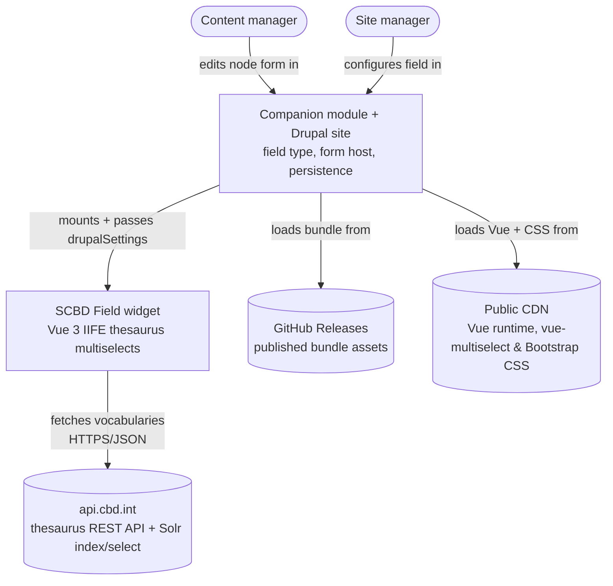
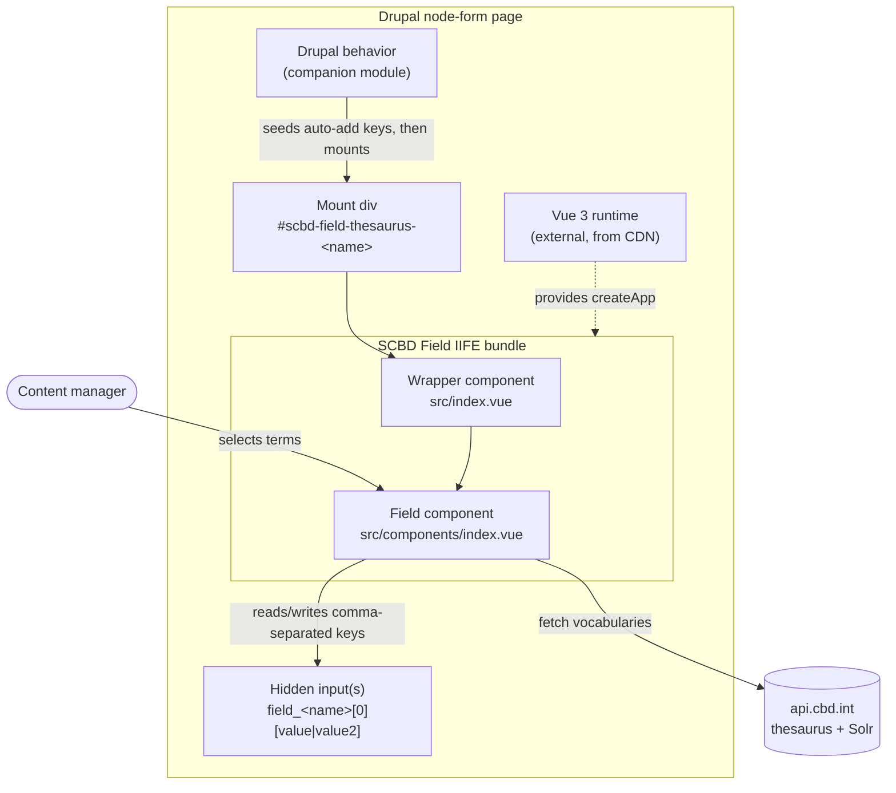
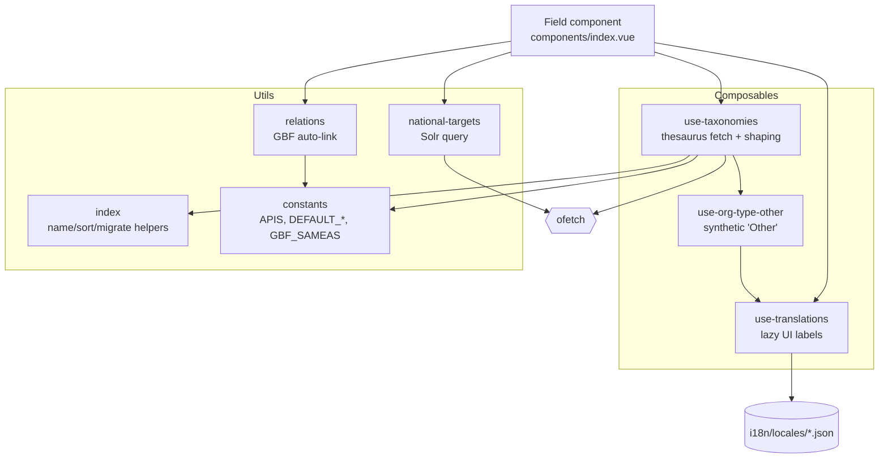
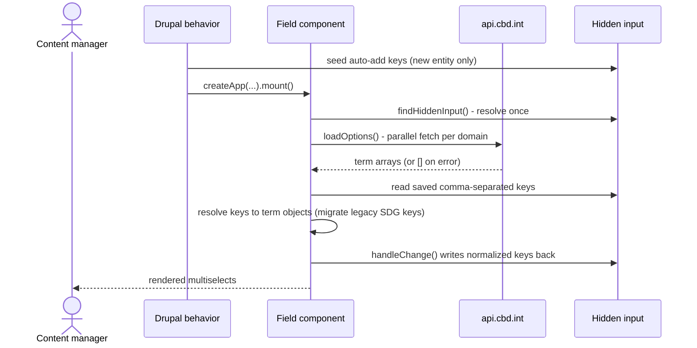
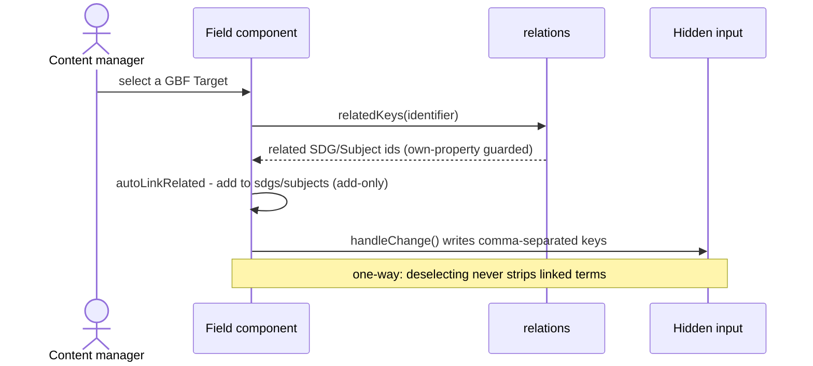
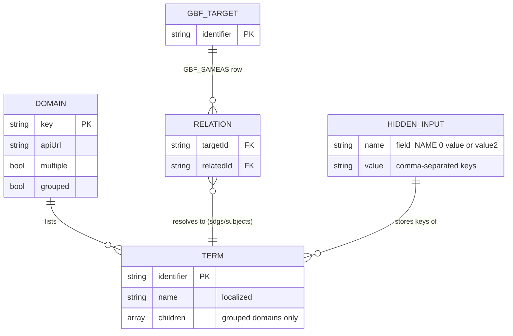
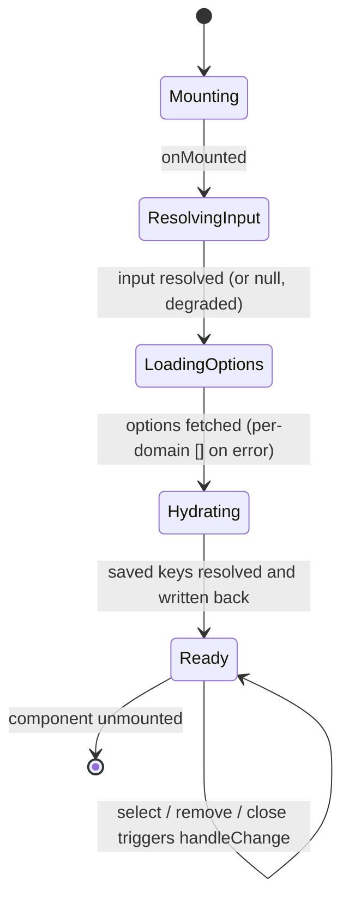
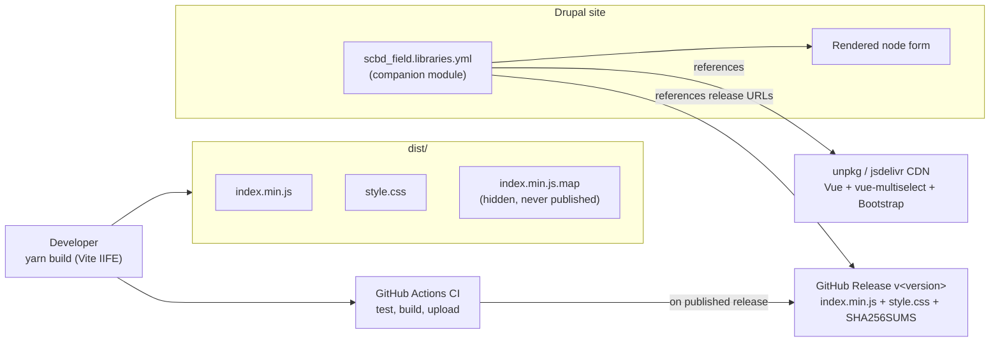

*2026-06-26 (last reviewed 2026-06-26) · references: [prd.md](prd.md), [CONTEXT.md](CONTEXT.md), [ADRs](adr/)*

> **▶ Living architectural plan** — the design-of-record for this widget as a standalone system.
> Not an implementation plan: it cuts no tasks, PRs, or branches (see [§15](#15-implementation-hand-off)).
> Revise in place; never fork or version-suffix.
>
> **⚠ Target-state plan (v3.0.0) — this branch is v1.0.0.** This plan describes the intended
> v3.0.0 widget: the in-module `ofetch` data layer, the `src/utils/` and `src/composables/`
> structure, `singleValueDomains`, `GBF_SAMEAS`, the locale files, and the release CI. The code on
> this branch is the v1.0.0 bundle (one grouped `@scbd/cached-apis` multiselect). Module paths
> below are inline code, not links, because those files arrive with the v3.0.0 cutover — see
> [decomp-seams.md](decomp-seams.md).
>
> **Plan vs. as-built.** This is the *intended design*; a companion as-built `architecture.md` (not
> yet written) will snapshot the code. When they disagree, `architecture.md` is the truth about the
> code and this plan the truth about the intent — reconcile, don't drift.
>
> **Wider system.** One project of the **Bioland** system; the cross-project hub lives in the hub
> repo (`bioland/bioland.md`, not in this repo). The only shared seam is with the companion module
> [scbd/drupal-module-scbd-thesaurus-tags](https://github.com/scbd/drupal-module-scbd-thesaurus-tags)
> — see [§2](#2-owned-interface-the-seam).

# SCBD Thesaurus Field (JS) — Architectural Plan

## 1. Context

This repo builds one thing: a Vue 3 widget, shipped as a single IIFE bundle, rendering the term
pickers for the SCBD Thesaurus Tags Drupal field. A content manager on a node form sees searchable
multiselects, each backed by a controlled vocabulary SCBD publishes on `api.cbd.int` (GBF targets,
SDGs, national targets, countries, CBD subjects, IUCN ecosystem types, and others).

The widget owns no state and talks to no database. It reads the saved value from a hidden Drupal
`<input>`, lets the content manager pick terms, and writes the selected keys back to that input as
a comma-separated string on every change; Drupal persists it like any form value. Picking a GBF
target also auto-fills its related SDGs and subjects from a static table.

Four things sit outside the boundary, depended on but not owned:

- the **companion Drupal module** ([scbd/drupal-module-scbd-thesaurus-tags](https://github.com/scbd/drupal-module-scbd-thesaurus-tags)) —
  field type, mount markup and hidden inputs, `drupalSettings`, the mount call, the admin form;
- **`api.cbd.int`** — the thesaurus REST API and Solr `index/select` endpoint;
- a **public CDN** — Vue 3 runtime, `vue-multiselect`, Bootstrap CSS;
- **GitHub Releases** — where the bundle publishes and `libraries.yml` points.

Everything else serves the DOM-level contract in [§2](#2-owned-interface-the-seam). See the
[README](../README.md) for usage and props.

## 2. Owned interface (the seam)

A **deep module behind a DOM hydration contract**: a small stable surface hides all fetching and
shaping (incl. grouped nesting), localization, GBF auto-linking, legacy SDG migration, write-back,
and every failure path. The contract (selector convention,
hidden-input name, prop names) is *owned* by the companion module's behavior; this bundle
*implements* the widget that plugs into it. Being a DOM handshake makes it fragile: a rename on
either side breaks the field silently, and no test spans both repos ([§13](#13-deferred--open-items)).

**Mount.** The Drupal behavior reads `drupalSettings.scbd_field`, finds the mount `
`
(`#scbd-field-thesaurus-<name>`), seeds the hidden input on a new entity, then calls
`Vue.createApp(ScbdDrupalScbdFieldJs.default, props).mount(...)` once — guarded by
`mountEl.__vue_app__` against double-mounting. Vue is `external`; the host supplies the runtime.

**Hidden-input handshake.** `findHiddenInput()` in `src/components/index.vue` locates
`input[name='field_<name>[0][value]']` (or `...[value2]` when `isAdditionalField`), falling back to
`#edit-field-<name>-0-value`. The field `name` is validated against `^[a-z0-9_]+$` before any
selector is built. No initial-value prop: saved keys are read from the input on mount
(`loadInitialValues`) and the de-duplicated, comma-joined selection written back on every
`@select` / `@remove` / `@close` via `handleChange`. The hidden input is the single source of
truth — preloading and new-entity seeding stay the host page's job.

**Props read.** `name` (the only required prop), `countries` (default `['be']`), `locale` /
`locales`, `domains`, `singleValueDomains`, `isAdditionalField`, `description` (help text, default
`''`), `debug`.

**`singleValueDomains` default (load-bearing).** The Drupal glue never passes it, so the bundle's
frozen default applies:
`DEFAULT_SINGLE_VALUE_DOMAINS = ['orgTypes','govTypes','projectStatuses','geoScopes','documentTypes','ecosystemTypes','jurisdictions','eventStatuses']`
in `src/utils/constants.js` (deferred item, [§13](#13-deferred--open-items)).

The host only ever sees a mounted app reading and writing one hidden input.

## 3. System Context (C4 L1) [sources](#architecture-view-abbreviations-sources)

The site manager configures domain order and the two auto-add toggles at
`/admin/config/scbd-field`.

## 4. Containers (C4 L2) [sources](#architecture-view-abbreviations-sources)

One deployable artifact (the IIFE bundle) running inside a Drupal page that supplies its
collaborators:

The bundle is deliberately thin: `src/index.js` registers the global `ScbdDrupalScbdFieldJs`;
the wrapper `src/index.vue` declares the public prop surface (defaulted from shared constants) and
forwards to the field component, which holds all behavior.

## 5. Components (C4 L3) [sources](#architecture-view-abbreviations-sources)

Work splits between composables (stateful, locale-bound data access) and pure utils; the component
wires them, and the modules know nothing of Vue.

| Module | Responsibility |
| --- | --- |
| `composables/use-taxonomies.js` | Fetch and normalize each thesaurus domain to `{ identifier, name }`; per-domain shaping; resolve saved keys to terms (`lookUp`). In-module replacement for `@scbd/cached-apis`, no caching. |
| `utils/national-targets.js` | The one non-thesaurus domain: builds and posts a Solr `index/select` query scoped by country and locale, normalizes the docs. |
| `utils/relations.js` | GBF auto-link source. `relatedKeys(id)` looks up `GBF_SAMEAS`; only GBF target ids resolve, keeping the link one-way. |
| `utils/constants.js` | Single source of truth: default domain lists, API URL map, document/org-type id filters, `GBF_SAMEAS`. |
| `utils/index.js` | Pure helpers: name localization, sort comparators, legacy SDG migration, grouped-children builder. |
| `composables/use-translations.js` | UI labels loaded on demand per locale (`import.meta.glob`); English bundled statically as the always-present fallback. |
| `composables/use-org-type-other.js` | Builds the synthetic "Other" organization type with a localized title from the translation files. |

## 6. Key Flows

### 6.1 Mount and hydrate

Options must load before hydration because grouped domains and national targets resolve saved
children out of the loaded option list.

The write-back during hydration is intentional: it rewrites legacy `SDG-GOAL-*` keys to
`SUSTAINABLE-DEVELOPMENT-GOAL-*` so the saved value migrates on the next real save.

### 6.2 Edit and auto-link

Auto-linking fires only on `@select`, only for `LINKABLE_DOMAINS` (`sdgs`, `subjects`) that are
rendered and configured multi-select.

## 7. Data Model

No persisted schema in this repo — only in-memory shapes plus the comma-separated string.

A **domain** is one vocabulary; its **terms** are trimmed to `{ identifier, name }`. The **hidden input** stores identifiers joined by commas — national
targets the opaque Solr `uniqueIdentifier_s` (e.g. `ort-nt7-be-276962-2`), the rest slug keys.
`GBF_SAMEAS` maps each GBF target to related identifiers; only SDG and subject entries match a
loaded option, so Aichi ids and stray GUIDs are ignored for free. The glossary
([CONTEXT.md](CONTEXT.md)) is the source of record for these terms.

## 8. State Machine

A short, forward-only hydration sequence landing in a steady "Ready" state where edits drive
write-backs.

Every transition fails soft: a missing hidden input logs and degrades write-backs to a no-op; a
failed domain fetch resolves to `[]` so one bad domain cannot reject the shared `Promise.all`.

## 9. Connectors & Rules

The behavior hidden behind the seam:

- **Thesaurus source.** REST domains hit
  `GET https://api.cbd.int/api/v2013/thesaurus/domains/<domain>/terms` via `ofetch` (20s timeout,
  `[]` on error) in `use-taxonomies.js`.
- **National Targets 7 via Solr.** `POST`s to `https://api.cbd.int/api/v2013/index/select`, scoped
  by `government_s` and locale title fields, sorting on the `_s` string field (sorting `_t`
  errors). Country/locale tokens are regex-whitelisted at the boundary and re-asserted inside the
  query builder (defense in depth). With multiple locales, alternate-locale titles are requested as
  a blank-title fallback ([ADR 0002](adr/0002-national-targets-alternate-locale-title-fallback.md)).
- **GBF auto-link.** Fills related SDGs/subjects from the static `GBF_SAMEAS` table, scoped to
  rendered `sdgs`/`subjects`; one-way, add-only; own-property reads only, so prototype keys
  (`__proto__`, `constructor`) cannot return a non-array.
- **Legacy SDG migration.** `SDG-GOAL-NN` reads as `SUSTAINABLE-DEVELOPMENT-GOAL-NN`, rewritten on
  next save; other keys untouched.
- **Term-name resolution & localization.** `shortTitle` → `title` → `name`, each in the active
  locale with English fallback, never a non-string. UI labels load on demand (`import.meta.glob`);
  English is bundled statically; a missing locale file warns once and falls back.
- **Domain shaping.** Org and gov types split one response; document types are a filtered subset;
  biosafety subject groups are the subjects with children; the synthetic `ORG-TYPE-OTHER` is
  appended to org types.

The companion-module seam is the DOM handshake of [§2](#2-owned-interface-the-seam); the
`api.cbd.int` seam is read-only HTTPS.

## 10. Build, Release & Deployment

No server — static assets on a GitHub release, referenced by the companion module's
`libraries.yml`:

Vite library build (IIFE, esbuild minify, PurgeCSS) in [`vite.config.js`](../vite.config.js). CI
(`.github/workflows/ci.yml`, arrives with v3.0.0) tests and builds on every push; on a published
release it verifies the tag matches `package.json` and sits on the default branch, uploads
`index.min.js`, `style.css`, and `SHA256SUMS`, then re-downloads and checksum-verifies. Source maps
are `hidden` and excluded from every publish path ([ADR 0003](adr/0003-source-map-hygiene.md)).

## 11. Quality Attributes (NFRs)

| Attribute | Target | How the design meets it |
| --- | --- | --- |
| Security (injection) | No untrusted input reaches a Solr query or `querySelector` | Country/locale tokens regex-whitelisted at the boundary and re-asserted inside `indexQuery`; field name validated against `[a-z0-9_]+` before any selector. |
| Security (prototype pollution) | Relation lookups cannot return non-array prototype members | `relatedKeys` reads `GBF_SAMEAS` via `hasOwnProperty` only; `[]` for `__proto__`/`constructor`/etc. |
| Security (source exposure) | Original source not downloadable from CDN/release | `sourcemap: 'hidden'` + `files` allowlist + CI artifact negation ([ADR 0003](adr/0003-source-map-hygiene.md)). |
| Supply chain | Reproducible, minimal dependencies | All deps pinned (no `^`/`~`); Vue external; only `change-case`, `ofetch`, `vue-multiselect` bundled; releases ship `SHA256SUMS`. |
| Availability / resilience | One slow or failing endpoint never freezes or breaks the field | 20s timeout and `[]` on error on every fetch path; missing hidden input degrades to a logged no-op. |
| Performance | Minimal work per render and per mount | Parallel domain fetches; input and per-domain flags resolve once; locale files lazy (English path costs zero dynamic imports); PurgeCSS-trimmed CSS. |
| Internationalization | Text resolves to the content manager's locale with a safe fallback | Labels fall back locale → English → raw key; term names `shortTitle` → `title` → `name`; national targets request alternate-locale titles ([ADR 0002](adr/0002-national-targets-alternate-locale-title-fallback.md)). |
| Maintainability | Defaults and conventions cannot silently drift | Default domain lists and API map live once in `constants.js`, shared by wrapper and component; kebab-case files; unit, regression, and smoke tests. |
| Compatibility | Bundle stays small and host-controlled | IIFE with one global; host supplies a matching Vue 3 runtime. |

## 12. Architecture Decisions

Recorded as ADRs in [`docs/adr/`](adr/); rationale lives there.

- [ADR 0001](adr/0001-record-architecture-decisions.md) — Record architecture decisions.
- [ADR 0002](adr/0002-national-targets-alternate-locale-title-fallback.md) — Alternate-locale
  titles as a National Targets fallback.
- [ADR 0003](adr/0003-source-map-hygiene.md) — Stop publishing the JS source map.

## 13. Deferred / Open Items

Each carries an owner and a provisional default; the cross-project register lives in the hub repo
(`bioland/bioland.md`).

| Item | Owner | Notes |
| ---- | ----- | ----- |
| **DOM handshake has no end-to-end test** | cross (this repo ↔ companion module) | The mount contract spans two repos with no test crossing the seam; a rename on either side breaks the field silently. The defining coupling of this widget. |
| **`singleValueDomains` not Drupal-configurable** | this repo | Drupal glue never passes it, so the frozen default in `constants.js` applies; per-site single-select needs a companion-behavior code change. |
| **Locale drift — only `en.json` ships** | this repo | `src/i18n/locales/` holds only `en.json`, so non-English sites get English domain labels. The loader supports more files — the gap is content, not code. |
| **No CDN integrity pinning at runtime** | companion module | Dev `index.html` uses SRI, but `libraries.yml` references Vue and CSS without documented SRI; a compromised CDN asset loads unverified. |
| **`value2` column runtime-dead** | companion module | The field stores `value`/`value2` but no second instance mounts (`isAdditionalField:false` in practice). Decide wire-up vs remove + backfill. |
| **Stale shipped bundle in the field repo** | companion module | The companion repo carries an older local copy of this bundle; re-sync to the release and pick local-vs-release delivery. |
| **Canonical-branch ambiguity** | this repo | `master` is default, `latest` the publish tag, `plan-retro` carries the docs. Confirm the integration branch before cutting tasks. |

## 14. Verification Checklist

Product-level acceptance is [prd.md § Success Metrics](prd.md#success-metrics) — one list, not
two. The cross-project checks below also appear in the hub checklist (`bioland/bioland.md`).

- [ ] *(cross)* A tagged node's hidden input holds comma-joined stable keys → the companion module
      persists them and exposes the raw string over JSON:API.
- [ ] *(cross)* The bundle version Drupal loads matches what the companion module expects → the
      picker mounts and writes keys back.

## 15. Implementation hand-off

To implement a change, run the `docs-implementation-planner` skill against this plan, feeding it
[§2](#2-owned-interface-the-seam), [§9](#9-connectors--rules), the checklist, and the deferred
register; output lands under this repo's `docs/` tree (`docs/implementation-plan/` or
`docs/feature-<x>/implementation-plan/`). Any change to the selector convention, hidden-input name,
or prop surface is a cross-project change with the companion module
([scbd/drupal-module-scbd-thesaurus-tags](https://github.com/scbd/drupal-module-scbd-thesaurus-tags)):
update both plans, and treat the DOM-handshake test gap as the acceptance criterion to finally
close.

C4 / L1–L3 abbreviations (sources)

> Headings use [C4 model](https://c4model.com/) zoom levels — context, containers, components,
> code. `L1` = [system context](https://c4model.com/diagrams/system-context) (the system, users,
> connected externals), `L2` = [containers](https://c4model.com/diagrams/container) (runtime
> composition), `L3` = [components](https://c4model.com/diagrams/component) (the bundle's modules).

