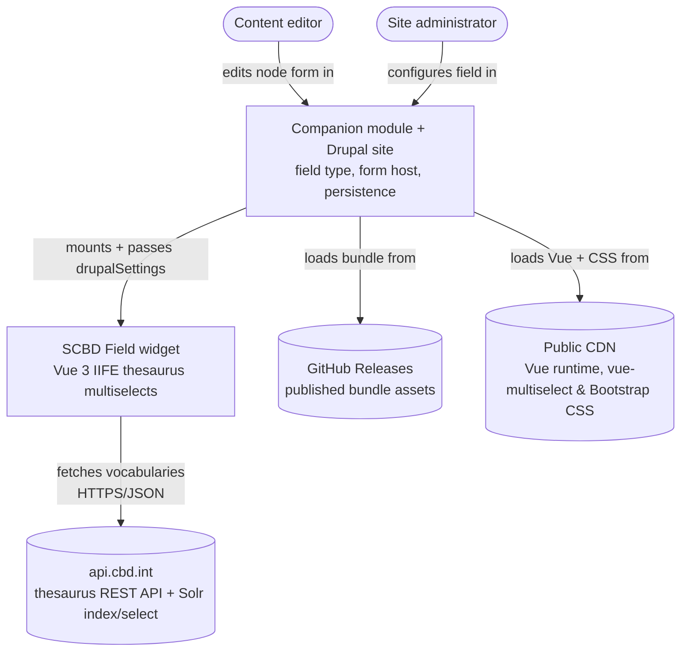
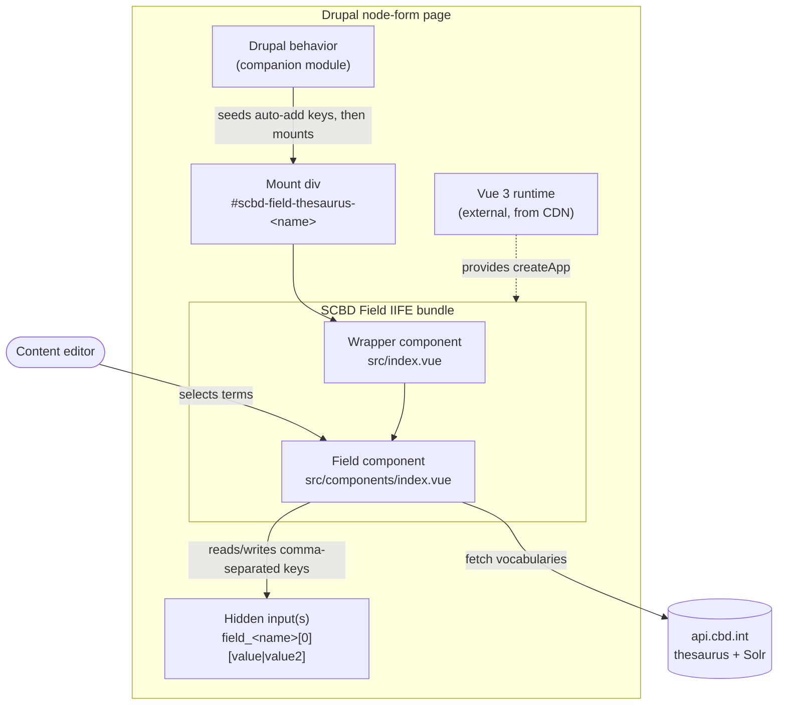
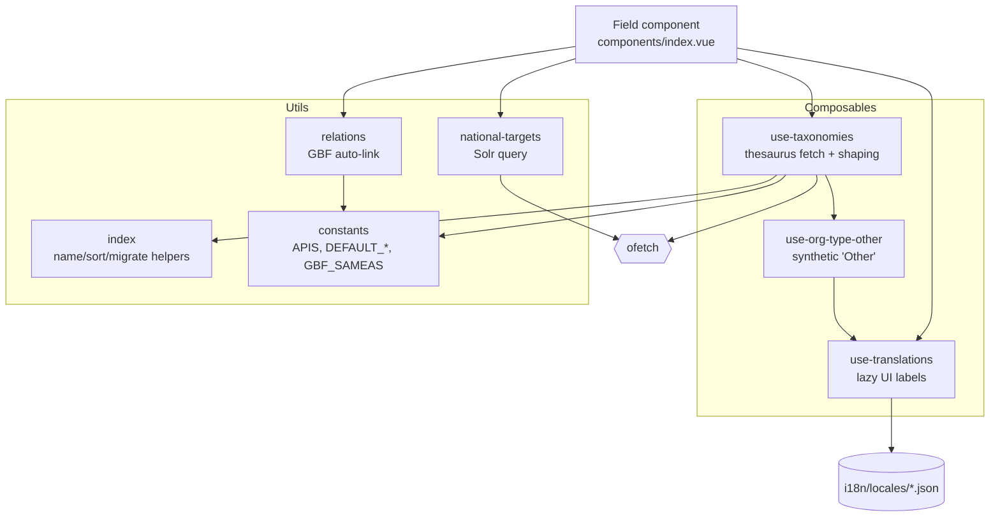
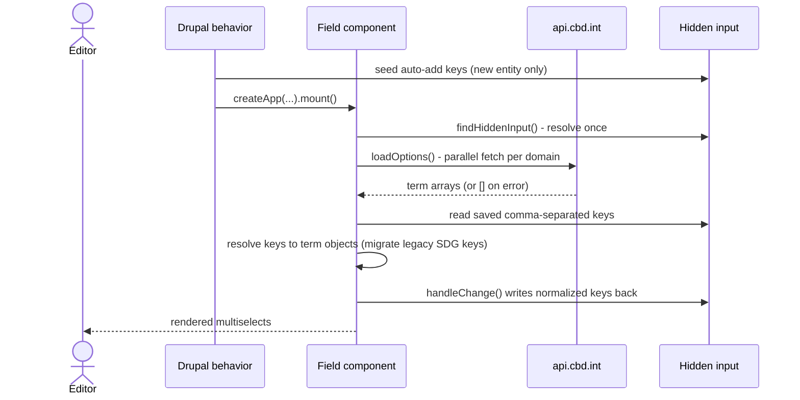
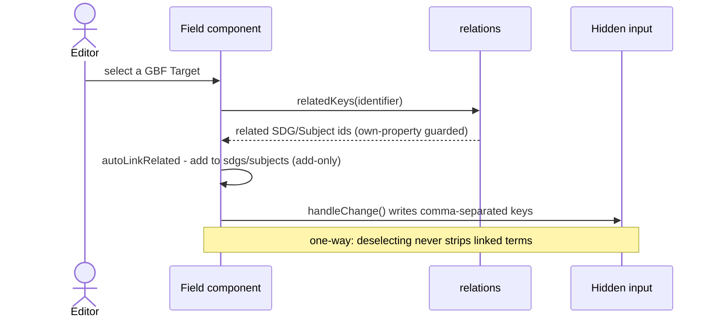
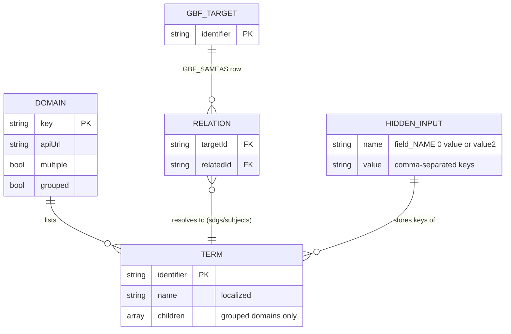
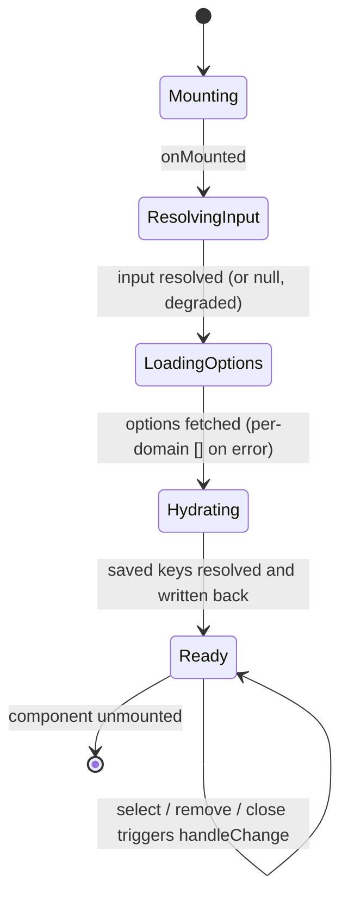
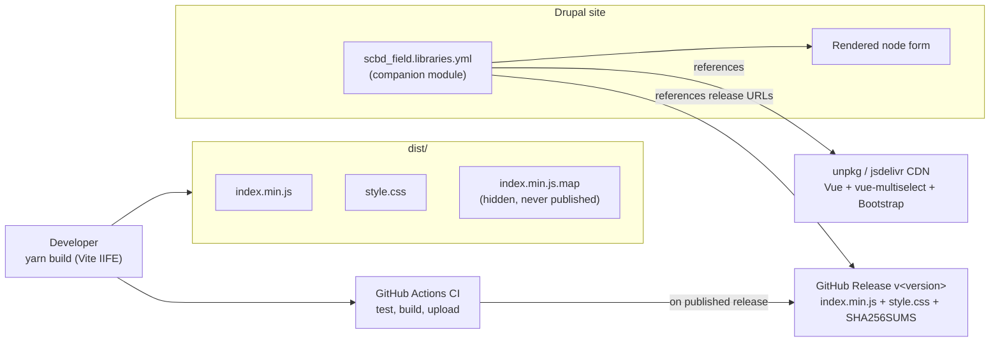

> **▶ This is a living architectural plan** — the design-of-record for **SCBD Thesaurus Field (JS)**,
> treated as a standalone system. It is NOT an implementation plan: it cuts no tasks, PRs, or branches.
> **To cut implementation tasks:** create an implementation plan under `docs/implementation-plan/` derived from this plan.
> **To revise:** update this document in place (edit the affected sections).
> Never fork or version-suffix this doc.
>
> **⚠ Target-state plan (v3.0.0) — this branch is v1.0.0.** This plan describes the **intended
> v3.0.0** widget: the in-module `ofetch` data layer, the `src/utils/` and `src/composables/`
> structure, `singleValueDomains`, `GBF_SAMEAS`, the locale files, and the release CI. The code on
> this branch is the **v1.0.0** bundle (one grouped `@scbd/cached-apis` multiselect); the v3.0.0
> source lives on `latest`. Module paths below are written as inline code (e.g. `src/utils/constants.js`),
> not links, because those files arrive with the v3.0.0 cutover. See
> [decomp-seams.md](decomp-seams.md) for the migration.
>
> **Plan vs. as-built.** This document is the *intended design* and the *owned contract*. A companion
> as-built `architecture.md` (not yet written) will be the *as-built snapshot* of the current code; the
> [prd.md](prd.md) is the *what / why*; the glossary is [CONTEXT.md](CONTEXT.md). The plan and the
> as-built doc overlap on purpose — one says what we meant to build, the other says what is there
> today. When they disagree, `architecture.md` is the truth about the code and this plan is the truth
> about the intent; reconcile them rather than letting them drift.
>
> **Place in the wider system.** This project is one project of the **Bioland** system. The
> cross-project hub (actors, shared statuses, end-to-end flows that span repos) lives in the
> designated **hub repo** (`bioland/bioland.md`, in the hub repo — not yet in this repo) during
> migration, and moves there with its sibling spokes. The only project this one shares a seam
> with is the companion Drupal module
> [scbd/drupal-module-scbd-thesaurus-tags](https://github.com/scbd/drupal-module-scbd-thesaurus-tags) —
> see [§2 Owned interface](#2-owned-interface-the-seam).

# SCBD Thesaurus Field (JS) — Architectural Plan

## 1. Context

This repository builds one thing: a Vue 3 widget, shipped as a single IIFE bundle, that renders the
term pickers for the SCBD Thesaurus Tags Drupal field. A content editor on a Drupal node form sees one
or more searchable multiselects, each backed by a controlled vocabulary the Secretariat of the
Convention on Biological Diversity (SCBD) publishes on `api.cbd.int`: Global Biodiversity Framework
targets, Sustainable Development Goals, national biodiversity targets, countries, CBD subjects, IUCN
ecosystem types, and others.

The widget owns no state of its own and talks to no database. It reads the field's saved value straight
from a hidden Drupal `<input>`, lets the editor pick terms, and writes the selected term keys back to
that same input as a comma-separated string on every change. Drupal persists the input like any other
form value. Picking a GBF target also auto-fills its related SDGs and subjects from a static table.

**Why a plan as well as an `architecture.md`.** The v3.0.0 code is being written against this plan, and
a companion as-built `architecture.md` (not yet written) will capture what lands. The plan still earns its keep:
it is the document a change is designed *against*, and it is deliberately rich enough to regenerate the
as-built picture if the bundle were rebuilt from scratch. A design doc that is thinner than the artifact
it describes is not a plan — it is a stub. This one carries the full surface (the seam, the C4 views,
the data model, the flows, the failure behaviour, the NFRs, the decisions) so that a competent team
could build the right widget from it alone.

**Standalone framing.** Treat the widget as its own system with four things outside its boundary that
it depends on but does not own:

- the **companion Drupal module** ([scbd/drupal-module-scbd-thesaurus-tags](https://github.com/scbd/drupal-module-scbd-thesaurus-tags)),
  which defines the field type, emits the mount markup and hidden inputs, supplies `drupalSettings`,
  mounts the widget, and exposes the admin form. It is the one project this widget shares a runtime
  seam with;
- **`api.cbd.int`** — the thesaurus REST API and the Solr `index/select` endpoint the widget reads
  vocabularies from at runtime;
- a **public CDN** — the host page delivers the Vue 3 runtime, `vue-multiselect`, and Bootstrap CSS;
- **GitHub Releases** — where the built bundle assets are published and the Drupal `libraries.yml`
  points.

Everything else in this repo serves the narrow, DOM-level contract in [§2](#2-owned-interface-the-seam).
See the [README](../README.md) for field-level usage and the prop reference.

## 2. Owned interface (the seam)

This widget is a **deep module behind a DOM hydration contract**. A small, stable surface is what other
projects depend on; all of the vocabulary fetching, shaping, localization, relation-linking, and
write-back logic is hidden behind it. The contract itself — the selector convention, the hidden-input
name, and the prop names — is *owned* by the companion module's behavior; this bundle *implements* the
widget that plugs into it. The seam is a DOM handshake, which is exactly why it is fragile: a selector
or prop rename on either side breaks the field silently, and no test spans both repos
(see [§13](#13-deferred--open-items)).

**Mount.** The companion module's Drupal behavior reads `drupalSettings.scbd_field`, finds the mount
`
` (`#scbd-field-thesaurus-<name>`), seeds the hidden input on a new entity, then calls
`Vue.createApp(ScbdDrupalScbdFieldJs.default, props).mount(...)` once — guarded by `mountEl.__vue_app__`
so a re-attached Drupal behavior cannot double-mount. Vue is `external`; the host page supplies the
runtime.

**Hidden-input handshake.** The widget locates the hidden input via `findHiddenInput()` in
[`src/components/index.vue`](../src/components/index.vue): `input[name='field_<name>[0][value]']` (or
`...[value2]` when `isAdditionalField`), falling back to `#edit-field-<name>-0-value`. The field `name`
is validated against `^[a-z0-9_]+$` before any selector is built, so a malformed name is rejected and
logged rather than used. The widget takes **no** initial-value prop: saved keys are read from the
hidden input on mount (`loadInitialValues`), and the de-duplicated, comma-joined selection is written
back on every `@select` / `@remove` / `@close` via `handleChange`. The hidden input is the single source
of truth — preloading and new-entity seeding stay the host page's job.

**Props read.** `name` (the only required prop), `countries` (default `['be']`), `locale` / `locales`,
`domains`, `singleValueDomains`, `isAdditionalField`, `description` (help text rendered above the widget,
default `''`), `debug`.

**`singleValueDomains` default (load-bearing).** The Drupal glue never passes it, so the bundle's own
frozen default applies:
`DEFAULT_SINGLE_VALUE_DOMAINS = ['orgTypes','govTypes','projectStatuses','geoScopes','documentTypes','ecosystemTypes','jurisdictions','eventStatuses']`
in `src/utils/constants.js`. A domain in this list renders single-select
(one term or null); everything else is multi-select. Per-site single-select therefore needs a code
change on the Drupal side, not just configuration — recorded as a deferred item.

What is hidden behind the seam: which vocabularies are fetched and how, how terms are localized and
shaped, how grouped domains nest, how GBF auto-linking resolves, how legacy SDG keys migrate, and how
every failure degrades. None of that leaks across the DOM handshake — the host page only ever sees a
mounted app reading and writing one hidden input.

## 3. System Context (C4 L1) [sources](#architecture-view-abbreviations-sources)

Both human actors reach the widget through Drupal. The editor never touches the bundle directly; the
administrator configures domain order and the two auto-add toggles through the companion module's config
form at `/admin/config/scbd-field`. At runtime the widget reaches `api.cbd.int` for vocabulary data; the
host page delivers the Vue runtime and CSS.

## 4. Containers (C4 L2) [sources](#architecture-view-abbreviations-sources)

There is one deployable artifact (the IIFE bundle), but it only runs inside a Drupal page that supplies
several collaborators. This view shows that runtime composition rather than separate processes.

The bundle is deliberately thin. [`src/index.js`](../src/index.js) registers the global
`ScbdDrupalScbdFieldJs` and exports the wrapper. The wrapper [`src/index.vue`](../src/index.vue) only
declares the public prop surface (defaulted from shared constants) and forwards everything to the field
component [`src/components/index.vue`](../src/components/index.vue), which holds all the behavior. Vue is
marked external in the build, so the host page or the Drupal `vue` library must provide it.

## 5. Components (C4 L3) [sources](#architecture-view-abbreviations-sources)

Inside the field component, work splits between composables (stateful, locale-bound data access) and pure
utility modules (fetching, shaping, relation lookups). The component wires them together; the modules
know nothing of Vue.

| Module | Responsibility |
| --- | --- |
| `composables/use-taxonomies.js` | Fetch and normalize each thesaurus domain to the `{ identifier, name }` shape; per-domain shaping rules; resolve saved keys back to term objects (`lookUp`). In-module replacement for the former `@scbd/cached-apis`, with no caching layer. |
| `utils/national-targets.js` | The one domain that does not come from the thesaurus REST endpoint. Builds and posts a Solr `index/select` query, scoped by country and locale, and normalizes the docs. |
| `utils/relations.js` | The GBF auto-link source. `relatedKeys(id)` looks up `GBF_SAMEAS`; only GBF target ids resolve to a list, which keeps the link one-way. |
| `utils/constants.js` | Single source of truth for the default domain lists, the API URL map, document/org-type id filters, and the `GBF_SAMEAS` relation table. |
| `utils/index.js` | Pure helpers: name localization, sort comparators, legacy SDG key migration, and the grouped-children builder. |
| `composables/use-translations.js` | UI-label translations loaded on demand per locale (`import.meta.glob`), with English bundled statically as the always-present fallback. |
| `composables/use-org-type-other.js` | Builds the synthetic "Other" organization type (the thesaurus has no such term) with a localized title drawn from the translation files. |

## 6. Key Flows (sequence diagrams)

### 6.1 Mount and hydrate

When the Drupal behavior mounts the app, the component resolves its hidden input once, fetches every
configured domain's options in parallel, then resolves the saved keys against those options and writes a
normalized value back. Options must load before hydration because grouped domains and national targets
resolve their saved children out of the already-loaded option list.

The write-back during hydration is intentional: it rewrites legacy `SDG-GOAL-*` keys to the current
`SUSTAINABLE-DEVELOPMENT-GOAL-*` identifiers so the saved value migrates forward on the next real save.

### 6.2 Edit and auto-link

Auto-linking fires only on `@select`, and only for domains in `LINKABLE_DOMAINS` (`sdgs`, `subjects`)
that are actually rendered and configured multi-select. It is add-only and one-way: selecting a GBF
target adds its related terms, selecting an SDG or subject adds nothing back, and removing a GBF target
leaves any previously added terms in place.

## 7. Data Model

There is no persisted schema in this repo. The "data model" is the small set of in-memory shapes the
widget passes around, plus the comma-separated string it reads and writes.

A **domain** is one controlled vocabulary; its options are **terms** trimmed to `{ identifier, name }`
(grouped domains such as `bchSubjectGroups` carry a `children` array). The **hidden input** stores only
term identifiers, joined by commas. National targets use the Solr `uniqueIdentifier_s` value (for
example `ort-nt7-be-276962-2`), an opaque non-UUID string; the GBF, SDG, and subject domains use
slug-style keys. The `GBF_SAMEAS` table maps each GBF target to a list of related identifiers; only the
SDG and subject entries match a loaded option and get added, while Aichi-target ids and stray GUIDs are
ignored for free because they never appear in a linkable domain. The glossary
([CONTEXT.md](CONTEXT.md)) is the source of record for these terms — use those words in code, comments,
and commits.

## 8. State Machine

The component's own lifecycle is the only stateful behavior worth a diagram: a short, forward-only
hydration sequence that lands in a steady "Ready" state where user edits drive write-backs.

Every transition fails soft by design. A missing hidden input does not abort the mount; the component
logs an error and continues, and later write-backs degrade to a no-op rather than throwing on every
interaction. A failed domain fetch resolves to an empty array so one bad domain cannot reject the shared
`Promise.all` batch or block the others.

## 9. Connectors & Rules

This is the behaviour hidden behind the seam — the adapters the widget runs against `api.cbd.int` and
the business rules it enforces.

- **Thesaurus source (the one external read).** Vocabularies are fetched client-side at runtime. REST
  domains hit `GET https://api.cbd.int/api/v2013/thesaurus/domains/<domain>/terms` via `ofetch` (20s
  timeout, `[]` on error) in `use-taxonomies.js`.
- **National Targets 7 via Solr.** The one domain not backed by a thesaurus domain. It `POST`s a Solr
  `index/select` query to `https://api.cbd.int/api/v2013/index/select`, scoped by the `government_s`
  country field and locale title fields, sorting on the `_s` string field (sorting a tokenized `_t`
  field errors). Country and locale tokens are whitelisted by regex at the boundary and re-asserted
  inside the query builder (defense in depth) so Solr metacharacters cannot reach a field name. When
  more than one locale is served, alternate-locale titles are requested and used as a fallback so no
  option renders blank (see [ADR 0002](adr/0002-national-targets-alternate-locale-title-fallback.md)).
- **GBF auto-link.** Selecting a GBF target fills its related SDGs and CBD subjects from the static
  `GBF_SAMEAS` table, scoped to the `sdgs` and `subjects` domains and only when they are rendered. The
  relation is one-way and add-only; the lookup reads own properties only, so prototype keys
  (`__proto__`, `constructor`) cannot return a non-array and break the caller.
- **Legacy SDG migration.** A saved `SDG-GOAL-NN` key is read as the current
  `SUSTAINABLE-DEVELOPMENT-GOAL-NN` identifier so the option resolves, then rewritten to the new key on
  the next save. Non-SDG keys pass through untouched.
- **Term-name resolution & localization.** A term's display name prefers `shortTitle`, then `title`,
  then `name`, each resolved to the active locale with an English fallback, and never returns a
  non-string. UI labels load on demand per locale (`import.meta.glob`); English is bundled statically
  as the always-present fallback, and a missing locale file warns once and falls back to English.
- **Domain shaping.** Organization types and government types split the same API response; document
  types are a filtered subset; biosafety subject groups are the subjects that have children; the
  synthetic localized "Other" organization type (`ORG-TYPE-OTHER`) is appended to the org-types list.

The seam to the companion module is the DOM handshake of [§2](#2-owned-interface-the-seam); the seam to
`api.cbd.int` is read-only HTTPS. This widget writes nothing back to either except the editor's
selection into the local hidden input.

## 10. Build, Release & Deployment

There is no server to deploy. The build produces static assets that ride along with a GitHub release;
the companion module's `libraries.yml` points at those release URLs and at a CDN for Vue and CSS.

The build is a Vite library build (IIFE, esbuild minify, PurgeCSS-trimmed CSS) configured in
[`vite.config.js`](../vite.config.js). CI (`.github/workflows/ci.yml`, arrives with v3.0.0)
runs smoke tests and a build on every push. On a published release it rebuilds, verifies the tag matches
`package.json` and sits on the default branch, uploads `index.min.js`, `style.css`, and a `SHA256SUMS`
file, then re-downloads and checksum-verifies them. Source maps are emitted as `hidden` and excluded
from every publish path (see [ADR 0003](adr/0003-source-map-hygiene.md)). Only `change-case`, `ofetch`,
and `vue-multiselect` are bundled; Vue is external.

## 11. Quality Attributes (NFRs)

| Attribute | Target | How the design meets it |
| --- | --- | --- |
| Security (injection) | No untrusted input reaches a Solr query or a `querySelector` | National-target country/locale tokens are whitelisted by regex at the boundary and re-asserted inside `indexQuery` (defense in depth); the field name is validated against `[a-z0-9_]+` before any selector is built. |
| Security (prototype pollution) | Relation lookups cannot return non-array prototype members | `relatedKeys` reads `GBF_SAMEAS` only via `hasOwnProperty` and returns `[]` for `__proto__`/`constructor`/etc. |
| Security (source exposure) | Original source is not downloadable from the CDN/release | `sourcemap: 'hidden'` plus an allowlisted `files` field and CI artifact negation keep the `.map` off every published surface ([ADR 0003](adr/0003-source-map-hygiene.md)). |
| Supply chain | Reproducible, minimal dependencies | All runtime/dev deps are pinned (no `^`/`~`); Vue is external; only `change-case`, `ofetch`, and `vue-multiselect` are bundled; release assets ship a `SHA256SUMS`. |
| Availability / resilience | One slow or failing endpoint never freezes or breaks the field | Every fetch path has a 20s timeout and resolves to `[]` on error; a missing hidden input degrades to a logged no-op. |
| Performance | Minimal work per render and per mount | Domains fetch in parallel; the hidden input and per-domain `grouped`/`multiple` flags resolve once, not per render; locale files load lazily so the default (English) path costs zero dynamic imports; CSS is PurgeCSS-trimmed. |
| Internationalization | Term and label text resolve to the editor's locale with a safe fallback | Labels fall back locale → English → raw key; term names resolve `shortTitle` → `title` → `name`; national targets request alternate-locale titles as a fallback ([ADR 0002](adr/0002-national-targets-alternate-locale-title-fallback.md)). |
| Maintainability | Defaults and conventions cannot silently drift | Default domain lists and the API map live once in `constants.js` and are shared by wrapper and component; source files are kebab-case; unit, regression, and smoke tests cover the utils and the harness. |
| Compatibility | Bundle stays small and host-controlled | IIFE with a single global; host supplies a matching Vue 3 runtime rather than bundling its own copy. |

## 12. Architecture Decisions

Decisions are recorded as ADRs in [`docs/adr/`](adr/); rationale lives there, not here.

- [ADR 0001](adr/0001-record-architecture-decisions.md) — Record architecture decisions.
- [ADR 0002](adr/0002-national-targets-alternate-locale-title-fallback.md) — Request alternate-locale
  titles as a fallback for National Targets.
- [ADR 0003](adr/0003-source-map-hygiene.md) — Stop publishing the JS source map for the IIFE bundle.

## 13. Deferred / Open Items

The items below are consciously out of scope or unresolved for this project; each carries an owner and a
provisional default. The cross-project register that supersedes this for system-wide items lives in the
hub repo's deferred register (`bioland/bioland.md`, in the hub repo — not yet in this repo).

| Item | Owner | Notes |
| ---- | ----- | ----- |
| **DOM handshake has no end-to-end test** | cross (this repo ↔ companion module) | The mount contract (selector, hidden-input name, props) spans two repos with no test crossing the seam; a rename on either side breaks the field silently. The defining coupling of this widget. |
| **`singleValueDomains` not Drupal-configurable** | this repo | The Drupal glue never passes it, so the bundle's frozen default in `constants.js` applies. Per-site single-select needs a code change on the Drupal side (uncomment the `singleValueDomains` line in the companion behavior). |
| **Locale drift — only `en.json` ships** | this repo | The README implies labels for many languages, but `src/i18n/locales/` contains only `en.json` today, so a non-English Drupal site gets English domain labels. The loader supports dropping in more files — the gap is content, not code. |
| **No CDN integrity pinning at runtime** | companion module | The dev `index.html` uses SRI for its CSS, but the Drupal `libraries.yml` references Vue and CSS by CDN URL without documented SRI. A compromised or version-drifted CDN asset would load unverified. |
| **`value2` column runtime-dead** | companion module | The field stores `value` / `value2`, but no second instance mounts (`isAdditionalField:false` in practice). Decide wire-up vs remove + backfill. |
| **Stale shipped bundle in the field repo** | companion module | The companion repo carries an older local copy of this bundle; re-sync it to the release and pick local-vs-release delivery. |
| **Canonical-branch ambiguity** | this repo | `master` is default, `latest` is the publish tag, `plan-retro` carries the docs. Confirm and document the integration branch before cutting tasks. |

## 14. Verification Checklist

End-to-end checks for this project. The ones marked *(cross)* also appear in the
hub checklist (`bioland/bioland.md`, in the hub repo) because they touch the companion module.

- [ ] A saved value hydrates with no user change → the keys written back equal the saved keys after
      legacy-SDG migration, on every configured domain (including national-target identifiers — the
      opaque Solr `uniqueIdentifier_s` value, not a UUID — and grouped subjects).
- [ ] Any single vocabulary fetch fails or times out → zero uncaught errors; every fetch resolves to an
      array, the parallel load never rejects, and the rest of the form stays usable.
- [ ] Selecting a GBF target adds exactly the related SDGs and subjects from `GBF_SAMEAS` that exist in
      the rendered domains, adds nothing for SDG/subject selections, and never removes a prior pick.
- [ ] Every `SDG-GOAL-01..17` key read from a saved value resolves to an option and is rewritten to
      `SUSTAINABLE-DEVELOPMENT-GOAL-01..17` on the next save.
- [ ] Every rendered option has a non-empty label in the active locale or a defined fallback (no blank
      options), across all served locales including right-to-left.
- [ ] No country or locale token containing Solr metacharacters reaches the index query; a malformed
      primary locale falls back to English.
- [ ] The published release contains the minified script, the stylesheet, and the checksum, contains no
      source map, and does not include Vue.
- [ ] *(cross)* An editor tags a node → the saved hidden input holds comma-joined stable keys → the
      companion module persists them and exposes the raw key string over JSON:API.
- [ ] *(cross)* The bundle version Drupal loads matches what the companion module expects → the picker
      mounts and writes keys back.

## 15. Implementation hand-off

This plan designs the widget; it cuts no tasks. To implement a change, run the
`docs-implementation-planner` skill against this plan, feeding it [§2 Owned interface](#2-owned-interface-the-seam),
the [§9 Connectors & Rules](#9-connectors--rules), this checklist, and the deferred register. The output
is one implementation plan under this repo's `docs/` tree (`docs/implementation-plan/` for a repo-wide
build, or `docs/feature-<x>/implementation-plan/` for a scoped change), beside this plan.

Because the seam in [§2](#2-owned-interface-the-seam) is shared with the companion module
([scbd/drupal-module-scbd-thesaurus-tags](https://github.com/scbd/drupal-module-scbd-thesaurus-tags)),
any change to the selector convention, the hidden-input name, or the prop surface is a cross-project
change: update both this plan and that project's plan, and treat the DOM-handshake test gap above as the
acceptance criterion that must finally be closed across the two repos.

Where these architecture-view abbreviations come from (sources)

> These labels follow the C4 model for visualising software architecture. In this plan, `C4` means the
> four C's: context, containers, components, and code. `L1`, `L2`, and `L3` are local shorthand for
> the model's first three static-structure diagram levels.
>
> - **C4** is Simon Brown's model for describing software architecture through hierarchical
>   abstractions and diagrams: software systems, containers, components, and code
>   ([c4model.com](https://c4model.com/)).
> - **L1 / System Context** maps to the C4 "1. System context diagram": the zoomed-out view of
>   the system, its users, and directly connected external systems
>   ([c4model.com/diagrams/system-context](https://c4model.com/diagrams/system-context)).
> - **L2 / Containers** maps to the C4 "2. Container diagram": the system boundary expanded into
>   applications, data stores, and other runtime containers, including major technology choices and
>   communication paths ([c4model.com/diagrams/container](https://c4model.com/diagrams/container)).
> - **L3 / Components** maps to the C4 "3. Component diagram": one container decomposed into its
>   code-level components, responsibilities, and implementation details
>   ([c4model.com/diagrams/component](https://c4model.com/diagrams/component)).
>
> In short: the headings use C4 zoom levels. `L1` looks outside the widget, `L2` shows runtime
> container composition, and `L3` opens the widget bundle far enough to name the important modules.

