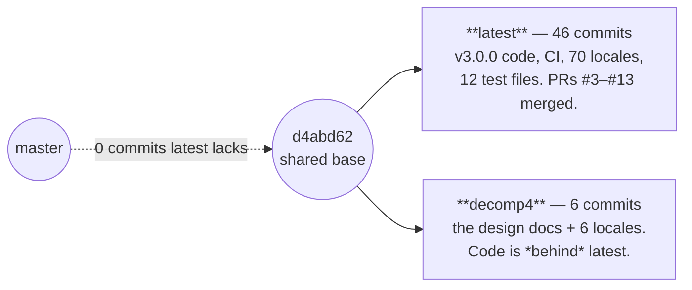
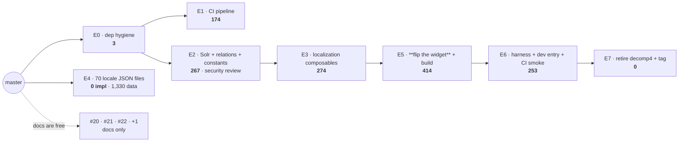

# PR Seam Options

> _**Doc:** how to get the v3.0.0 rewrite of the SCBD Thesaurus field widget onto `master`. It is
> **not** a pull request and not a code review — it is the plan for *how to make* the PRs._

> **This doc was rewritten on 2026-08-23 after an adversarial review, and its original premise was
> void.** Three independent critics on rival models (codex/OpenAI, agy/Gemini, grok/xAI) all landed
> on the same High-impact objection, verified against git: the v3.0.0 code is **not** an
> undecomposed pile needing seams. It is already committed, already cut into PRs, and already
> merged — onto the `latest` integration branch, as PRs **#3–#13**. A master-targeted re-seam of
> that same work was already attempted as PRs **#14–#17**, and all four were **closed**.
>
> The three seam options (A, B, C) below are kept as a **rejected record**, because they answer a
> question the repo has already answered. The live plan is **Option E**.
>
> _Devil's-advocate review 2026-08-23, 3 critics, verdict: reject the previous recommendation
> ("Option A, hybrid with C1 split out") — wrong base branch. Execution war-gamed the same day at
> depth 2._

---

## Where the work actually is

Measured, not asserted:

| Claim | Command | Result |
|-------|---------|--------|
| Tree is clean; nothing is uncommitted | `git status --porcelain` | empty |
| `latest` holds the rewrite | `git rev-list --count master..latest` | **46** commits, 106 files |
| It was already decomposed | `gh pr list --base latest --state merged` | **11 merged PRs (#3–#13)** |
| A master re-seam was already tried | `gh pr list` | **#14–#17 opened against `master`, all closed** |
| `decomp4` is a side-branch, not a re-seam | `git rev-list --count latest..decomp4` | **6** commits |
| `decomp4`'s code is *behind* `latest` | `git diff --numstat decomp4..latest -- src` | latest is ahead: 64 extra locales, a locale-parity test, ~50 lines of fixes |
| What only `decomp4` has | `git diff --numstat decomp4..latest -- docs` | the **design docs**: prd, architectural-plan, CONTEXT, DEV-PROCESS-ARTIFACTS, this file (1,374 lines) |

So the split is clean: **`latest` owns the code. `decomp4` owns the docs.** Nothing needs re-cutting.

---

## The sizing rule this plan must obey

**Target ~200 implementation LOC per PR, hard ceiling 600. Over the ceiling needs a documented
exception.** What counts is implementation code only — **tests, scaffolding, comments and blank
lines do not count**, and neither does generated data.

That single rule decides the shape of everything below. The 4,237-line `master..latest` diff sounds
unreviewable, but it is only **1,364 implementation lines**; the other 2,873 are 1,525 lines of tests
and 1,348 lines of generated locale JSON, both free under the rule. 1,364 splits into six PRs that
each land inside the ceiling.

---

## Option D — one release PR  *(rejected: breaks the ceiling)*

Promote `latest` to `master` in one PR. Recorded because it is the shortest path and it is what the
already-merged history invites — but **1,364 implementation lines is 2.3× the 600 ceiling**, and no
"review it as files rather than a diff" framing changes that. It also isn't as pre-reviewed as it
looks: `git log --no-merges --first-parent master..latest` shows **14 commits pushed directly to
`latest` with no PR at all**, including `e245cac "wip"`. Take it only as a deliberate, documented
exception when release timing beats reviewability.

---

## Option E — cherry-pick `latest` into sized slices  *(recommended)*

**The idea:** keep the DA's finding (the code is done and verified on `latest` — do not re-derive
it) *and* respect the ceiling. Cherry-pick from `latest` into six PRs, each under 600 impl LOC.
This is not the rejected A/B/C re-seam: those planned from the stale `decomp4` tree, this one lifts
known-good, CI-verified commits off `latest`.

| # | What it does (no "and") | Base | Impl LOC | Tests (free) |
|---|-------------------------|------|----------|--------------|
| E0 | Dep hygiene: add `change-case`, repoint `@scbd/cached-apis` from the absolute `file:` path to `0.0.2`. `master` becomes installable on a clean machine | master | **3** | — |
| E1 | CI pipeline + `.gitignore`, test step as `yarn test --passWithNoTests` (the smoke step arrives with E6) | E0 | **174** | — |
| E2 | Solr access, GBF relation table, shared constants, vitest config — the injection-guarded surface, **security review** | E0 | **267** | 311 |
| E3 | Localization + taxonomy composables (`utils/index.js`, `use-translations`, `use-org-type-other`, `use-taxonomies`) | E2 | **274** | 315 |
| E4 | The 70 UI locale JSON files | master | **0** (1,330 generated data — *documented exception*) | 18 |
| E5 | **Flip the widget**: rewrite the component, drop `@scbd/cached-apis`, modernize the build, bump to v3.0.0 | E3 | **414** | 788 |
| E6 | Dev harness + dev entry + the CI smoke step | E5 | **253** | 108 |
| E7 | Retire `decomp4`; tag v3.0.0 | E6 | 0 | — |

Docs ride free alongside, as the four PRs already scoped: **#20** (PRD + ADRs), **#21**
(architectural plan + CONTEXT), **#22** (this doc), and one new PR for
`DEV-PROCESS-ARTIFACTS.md`. Docs are not implementation LOC.

**Every code PR lands inside the ceiling.** Largest is E5 at 414 — over the ~200 target but under
600, and unsplittable: the build bump has no green standalone base, so it rides with the flip.

**E0 is the unlock.** `@scbd/cached-apis@0.0.2` is published on npm and exports all three names
`master` imports, so repointing the `file:` path makes `master` installable in one line. That is
what lets **CI land second instead of last** — every PR from E1 onward gets real install + build
signal, which none of A, B or C could offer.

**On E4 (locales).** All 71 locale paths are **net-new** (`git diff --numstat` reports 0 deletions
on every one) and `git grep i18n/locales master -- src` is empty — nothing on `master` imports them.
So they land alone, in any order. The 1,330 lines are generated translation data, not
implementation, which is why this PR is an exception rather than a violation. The 18-line
`src/i18n/locales.test.js` parity guard does **not** ride with them — it needs vitest, so it goes
with E2.

**Watch out:**
- Longest chain is **E0→E2→E3→E5→E6** (five links). That is the price of the ceiling; the
  alternative is Option D's single oversized PR.
- E0, E2 and E5 all touch `package.json`, so each must regen `yarn.lock` and rebase it after any
  upstream change — `ci.yml` runs `yarn install --immutable`, which rejects a straggler.
- The version bump and the release tag ride with E5/E7 and nothing earlier. `ci.yml`'s release job
  verifies the tag matches `package.json` **and** that the commit is on the default branch — tag
  anything before E5 merges and it publishes a v1 tree as v3.
- `decomp4` must not be merged for its code. Only its docs are ahead of `latest`.

---

## Corrected facts

The previous version of this doc asserted six "facts". Re-verified against the code, **five needed
correcting**:

| Fact as written | Status | What's actually true |
|-----------------|--------|----------------------|
| #1 `master` can't install — the `file:` absolute path on `@scbd/cached-apis` blocks a clean machine, so **CI can never come first** | **Soft, not hard** | `@scbd/cached-apis@0.0.2` **is published on npm**, and its bundle exports all three names `master` imports (`initializeApiStore`, `getData`, `lookUp` — verified by `npm pack` + grep). Repointing the `file:` path at `0.0.2` makes `master` installable in one line. CI *could* have come first. |
| #2 the cutover is one atomic move | Holds | Confirmed by the import graph. |
| #3 the build bump can't stand alone green | Holds *given* fact #1 | Weakens with fact #1 corrected, but E0 acts on it directly under Option E. |
| #4 **five** test files reach forward into the new widget | **Wrong — six** | `src/components/index.test.js:23` does `await import('./index.vue')`. The doc listed it as standalone. |
| #5 CI depends on the dev harness (`test:smoke` is its only test step) | Holds | `.github/workflows/ci.yml:52-53`. |
| #6 docs float free; every `package.json` PR must regen `yarn.lock` | Holds | And `ci.yml:17` sets `YARN_NODE_LINKER: node-modules` — **which no local `.yarnrc.yml` does.** So the old claim that pre-flip PRs were "green locally" was false: vitest dies with `ERR_REQUIRE_ESM` under PnP on Node 24. |

Also stale in the previous version:

- **`src/style.scss` (26 LOC) was assigned to no PR in any option** — it is imported by
  `src/index.vue:16`, so it belongs with the widget.
- **`index.html` was double-assigned**, counted in both the build row (108) and the harness row (263).
- **i18n was described as `en.json`** — this branch has 6 locale files (114 LOC); `latest` has **70**.
- **`bioland/*` does not exist** anywhere in the diff.
- The framing "one uncommitted pile" was wrong; the tree is clean.
- The LOC bar chart summed to 10,386 against a real 10,397.

---

## Rejected: Options A, B, C

All three cut the same pile into PRs against `master`. All three are superseded — the work is
already cut, on `latest`, and the master re-seam has been tried and closed (#14–#17). Kept for the
record, with what the critics found:

| | A — additive core, then flip | B — two-PR dark-ship | C — by reviewer/risk |
|--|--|--|--|
| Shape | A1 data layer → A2 flip → A3 harness → A4 CI; A5 docs free | B1 scaffolding → B2 flip | C0 docs; C1 Solr → C2 composables → C3 flip → C4 harness → C5 CI |
| Fatal objection | A1 adds `ofetch` to a `package.json` that still can't install, so A1 was never CI-verifiable either; the harness smoke test was assigned to both A2 and A3 | B1 can never be CI-green — a large blind merge | C's chain is five links, and the recommended "A with C1 split out" makes A1 depend on C1, recreating C |
| Killed by | agy #1, codex #3 | prior review | codex #2, grok #3 |

The one instinct worth keeping from C: **the Solr query construction deserves a focused security
read.** Under Option E that read is E2, and it has already happened once — PR **#8**
(`chore/p03-01-indexquery-whitelist-reassert`) merged the injection whitelist re-assertion on its
own. The critics added that the *other* sensitive boundary — the hidden Drupal input's field-name
validation and write path in `src/components/index.vue` — deserves the same, and it was reviewed
inside the widget PRs rather than alone. Worth a targeted re-read before E5 merges.

---

## Execution war-game (summary)

Option E was war-gamed move by move at depth 2 on 2026-08-23. The moves that carry real risk:

| Move | Likely failure | Countermove |
|------|----------------|-------------|
| E5 install | `yarn install --immutable` rejects the lockfile (`YN0028`) | regen in the same commit; never tag before it passes |
| E5 build | purgecss strips `vue-multiselect` classes from `dist/style.css` | extend the safelist; diff the CSS size against the last release |
| E5 verify | vitest dies `ERR_REQUIRE_ESM` locally | add `.yarnrc.yml` with `nodeLinker: node-modules` — **it is absent from every branch** |
| E7 release | release job publishes a v1 tree as v3 | tag only after E5 merges to the default branch |
| E7 | someone merges `decomp4` for its code | cherry-pick docs only |

**Abort conditions:** a clean-machine `yarn install --immutable` that cannot be made to pass; E5
needing rework twice; any tag pushed before E5 merges. Force-pushing, closing, or deleting a branch
or PR is never in scope — that is the user's call.

**Open questions nobody has decided:**
1. What happens to `decomp4` and the dozen stale local branches after E7?
2. Does the Drupal sibling repo still pass the legacy props the v3 README removed?
3. Who owns the security re-read of the hidden-input write path before E2 merges?

---

## What a good split means here

A pull request is cut at the right place when **a reviewer could approve only that PR, merge it,
and the repo would still build and ship.** Small isn't the goal — *independently mergeable* is.

Where this test comes from (sources)

> - **The seam test itself** is the `pr-decomposition` doctrine: a cut is real only when *"a reviewer
>   approved only this PR and nothing else, [and] the codebase would still be correct and shippable,"*
>   because *"good PRs are independently mergeable, not merely small."*
> - **Continuous integration** sets the same constraint. In *Continuous Integration*, Martin Fowler
>   writes that *"Continuous Integration can only work if the mainline is kept in a healthy state"*
>   ([martinfowler.com](https://martinfowler.com/articles/continuousIntegration.html)).
> - **Trunk-based development** states the outcome plainly: not breaking the build *"ensures the
>   codebase is always releasable on demand"* ([trunkbaseddevelopment.com](https://trunkbaseddevelopment.com/)).
> - **Size is a by-product, not the target.** Google's code-review guidance defines the right unit as
>   *"a minimal change that addresses just one thing"*
>   ([google.github.io/eng-practices](https://google.github.io/eng-practices/review/developer/small-cls.html)).

---

## Recommendation

**Option E.** The code question is settled — PRs #3–#13 answered it on `latest`, so nothing needs
re-deriving. What is *not* settled is reviewability: promoting `latest` in one PR (Option D) is
1,364 implementation lines against a 600 ceiling. Option E lifts the same verified commits off
`latest` into seven slices that each fit, with E0 buying real CI signal for every one of them.

The distinction that matters: cherry-pick from **`latest`**, never from `decomp4`. Re-seaming from
`decomp4` is what #14–#17 attempted before all four were closed, and `decomp4` is behind `latest`
on code — 64 locales, a parity test, and ~50 lines of fixes behind. `latest` is the source of truth.
