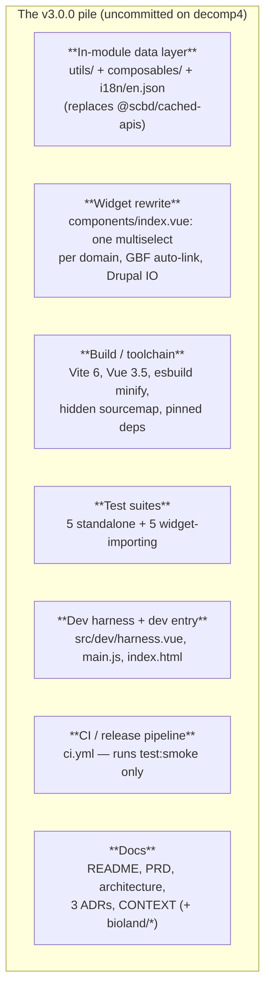
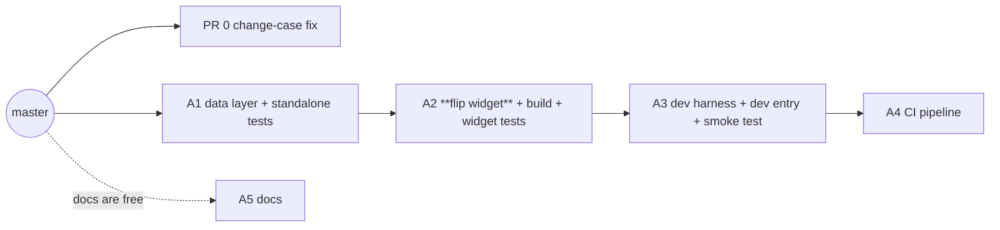
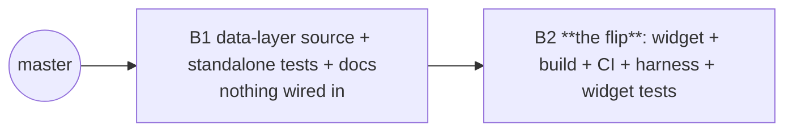
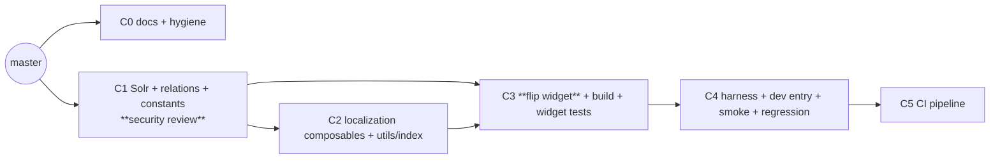

# PR Seam Options

> _**Doc:** "PR Seam Options" — three rival ways to cut one pile of work into pull requests, for a
> human to choose between. It is
> **not** a pull request and not a code review — it is the plan for *how to make* the PRs._

> **What this is.** The `decomp4` working tree holds the whole **v3.0.0 rewrite** of the SCBD
> Thesaurus field widget as one uncommitted pile, sitting on top of `master` (still v1.0.0). This
> doc lays out three rival ways to cut that pile into pull requests **against `master`**, so you can
> pick one. Nothing here is committed yet — these are proposals.
>
> **Post-review of the PR seam options.** "Post-review" here means **the three seam options below
> were red-teamed before being finalized** — a seam-critic and a devil's-advocate pass ran over an
> earlier draft of *these options* and proved several seams wrong using 3 leading llms. It does **not** mean a pull
> request was reviewed (no PR exists yet). Those fixes are folded in below, and what each reviewer
> found is recorded under "What the reviewers said."

> **Heads-up on the base branch.** These options are written as PRs **against `master`**, and that is what every
> option targets. For context: branch `latest` already holds a **46-commit** version of this same
> v3.0.0 work, and `master` has 0 commits `latest` doesn't — so these PRs effectively **re-seam**
> that work onto `master`.

---

## The work, in one picture

The pile is roughly **3,600 changed lines of source/config** plus a ~5,600-line `yarn.lock` regen.
The big pieces:

| Piece | What it is | Files (excl. tests) | Nature |
|-------|-----------|---------------------|--------|
| In-module data layer | Fetch/normalize/localize vocabularies; GBF→SDG/Subject relations; National Targets via Solr; legacy SDG-key migration | `src/utils/*` (4), `src/composables/*` (3), `en.json` | **adds-something-new** |
| Widget rewrite | One multiselect per "domain"; single vs multi; GBF auto-link; reads/writes the hidden Drupal input; field-name validation | `components/index.vue`, `index.vue`, `index.js` | **switches-it-on** |
| Build / toolchain | Vite 6, Vue 3.5, esbuild minify, `sourcemap:'hidden'`, purgecss safelist, deps pinned, v3.0.0 | `vite.config.js`, `package.json`, `index.html` | **move-only** (build) |
| Test suites | unit + regression — **5 are standalone, 5 import the new widget**, 1 is the harness smoke test | `*.test.js` (11 files, ~1.5k lines) | **adds-something-new** |
| Dev harness + entry | In-page BL2/BSL test page; `main.js`/`index.html` rewritten to mount it | `src/dev/harness.vue`, `main.js`, `index.html` | **adds-something-new** (not shipped) |
| CI / release | test→build→artifact; release-asset publish + checksums. **CI's only test step is `yarn test:smoke`** | `.github/workflows/ci.yml`, `.gitignore` | **adds-something-new** (infra) |
| Docs | README rewrite + PRD + architecture + ADRs + CONTEXT (+ cross-project `bioland/*`, maybe out of scope) | `README.md`, `docs/*` | **adds-something-new** (docs) |

---

## What a good split means here

A pull request is cut at the right place when **a reviewer could approve only that PR, merge it to
`master`, and the repo would still build and ship.** Small isn't the goal — *independently
mergeable* is.

Where this test comes from (sources)

> This is not a matter of taste. It restates a long-standing rule of continuous integration and
> trunk-based development: the shared branch must remain shippable after every merge, so a change is
> correctly scoped only when it can land on its own without breaking that branch.

> - **The seam test itself** is the `pr-decomposition` doctrine: a cut is real only when *"a reviewer
>   approved only this PR and nothing else, [and] the codebase would still be correct and shippable,"*
>   because *"good PRs are independently mergeable, not merely small."*
> - **Continuous integration** sets the same constraint. In *Continuous Integration*, Martin Fowler
>   writes that *"Continuous Integration can only work if the mainline is kept in a healthy state,"* with
>   the aim that *"the product should always be in a state where we can release the latest build"*
>   ([martinfowler.com](https://martinfowler.com/articles/continuousIntegration.html)).
> - **Trunk-based development** states the outcome plainly: collaborating on one branch and not breaking
>   the build *"ensures the codebase is always releasable on demand and helps to make Continuous Delivery
>   a reality"* ([trunkbaseddevelopment.com](https://trunkbaseddevelopment.com/)).
> - **Size is a by-product, not the target.** Google's code-review guidance defines the right unit as
>   *"a minimal change that addresses just one thing"* and *"one self-contained change,"* such that
>   *"the system will continue to work well... after the CL is checked in"* (a *CL*, or changelist, is
>   Google's term for a PR —
>   [google.github.io/eng-practices](https://google.github.io/eng-practices/review/developer/small-cls.html)).
>   Independence is the requirement; the small size tends to follow.
>
> In short: cut by whether each slice leaves the main branch green and releasable. A low line count is
> a symptom of a good cut, never its definition.

**Six facts shape every option. They are the same in all three, and the first four are hard
constraints, not preferences:**

1. **master can't run CI today.** Its `package.json` pins `@scbd/cached-apis` to a
   `file://<absolute-local-path>/...` **absolute local path**. A clean machine can't `yarn install` that.
   So **CI can only go green *after* the PR that removes that dep.** CI never comes first.
2. **The cutover is one atomic move.** You can't remove `@scbd/cached-apis` without rewriting the
   widget that imports it, and you can't rewrite it without removing the dep. **Every option has
   exactly one unavoidable "switch-it-on" PR.** *(A partial decoupling exists — see the note below —
   but it only splits the data half, not the template rewrite.)*
3. **The build bump can't stand alone green.** Vite 6 / Vue 3.5 need a buildable entry, and the only
   entry before the cutover still needs the unresolvable `file:` dep. So **build modernization rides
   with the cutover**, verified against the new entry — never as an isolated PR. *(This is the seam
   the first draft of Option C got wrong.)*
4. **Five test files reach forward into the new widget.** `constants.test.js`, `index.test.js`,
   `components/index.autolink.test.js`, `components/index.regression.test.js`, and the harness
   `harness.smoke.test.js` all import `@/index.vue` or `@/components/index.vue`. **They are NOT
   additive — they only pass once the widget is flipped, so they ride with the cutover (or the
   harness), never with the data layer.** Only the 5 standalone tests (`utils/index.test.js`,
   `utils/national-targets*.test.js`, `utils/relations.test.js`, `composables/use-taxonomies.test.js`)
   are truly additive.
5. **CI as written depends on the dev harness.** `ci.yml`'s only test step is
   `yarn test:smoke` → `vitest run src/dev/harness.smoke.test.js`. **So the CI PR can't go green until
   the harness PR has landed** — CI is a child of the harness, not a sibling. (Corollary: the 10
   unit/regression files are *never* run by CI; "verified green in isolation" means **locally**, not
   in CI.)
6. **Docs float free, and the lockfile doesn't.** Docs (and `bioland/*`) touch no code — land them
   anytime. But every PR that edits `package.json` must regen `yarn.lock`, and CI runs
   `yarn install --immutable`, which **rejects an out-of-sync lockfile.** So keep `package.json` edits
   in as few PRs as possible; any chained PR that touches it must rebase the lockfile.

> **Free pre-req, available to all three options — "PR 0".** `change-case` is imported by
> **master's** `src/index.js` but missing from master's deps — a latent break fixable in a **one-line
> PR against `master` today**, independent of the entire rewrite. It's the smallest, safest change in
> the pile; don't weld it to the giant flip PR. Land it first on its own if you like.

> **Note on fact #2 (could the cutover go further?).** The new `use-taxonomies` exposes
> `getData`/`lookUp` — the *same* names master's component imports from `@scbd/cached-apis`
> (`initializeApiStore, getData, lookUp`). So the **data** swap could in principle hide behind a shim
> and land "wired but dark." But the cutover also rewrites the **template** (one grouped multiselect →
> one-per-domain, auto-link, per-domain labels), which has no such seam. A shim would shrink the flip,
> not eliminate it. Treated as a refinement, not a fourth option.

---

## Option A — Additive core, then flip  *(recommended)*

**The idea:** Land everything the old widget doesn't touch as safe additive PRs first, then one PR
flips master onto the new widget. The classic "make the chain disappear by adding unused code"
approach — corrected so the additive PR really is additive.

**The PRs:**

| # | What it does (no "and") | Kind | Builds on |
|---|-------------------------|------|-----------|
| A1 | Add the in-module data layer (utils, composables, en.json) with the **5 standalone** tests, the test runner, and the runtime deps it needs; nothing imports it yet | adds-something-new | master |
| A2 | Flip the widget onto the data layer: rewrite the component, drop `@scbd/cached-apis`, modernize the build, bump to v3.0.0, and bring the **5 widget-importing** tests | switches-it-on | A1 |
| A3 | Add the dev harness, rewrite the dev entry (`main.js`/`index.html`), and add the smoke test | adds-something-new | A2 |
| A4 | Add the CI / release pipeline (green now — the bad dep is gone and the smoke test exists) | adds-something-new | A3 |
| A5 | Add the docs (README, PRD, architecture, ADRs, CONTEXT) | adds-something-new | master |

**Good:**
- Only **one** PR ever changes shipped behavior (A2). A1 before it is provably additive (standalone
  tests only) — the corrected version actually holds.
- A1 is a big-but-safe review: new modules with their own passing tests, easy to reason about.
- A5 docs and PR 0 are free, parallel, anytime.

**Watch out:**
- The chain is now **A1→A2→A3→A4** (four links), because CI rides behind the harness (fact #5), not
  beside it. That's the honest cost of CI-as-written.
- A2 is the chunky review — it carries the rewrite, the build bump (fact #3), *and* the 5
  widget-importing tests. It's the one place to spend reviewer attention.
- Keep A2 the *only* PR after A1 that touches `package.json` deps, or you'll fight the lockfile
  (fact #6).

---

## Option B — Two-PR dark-ship

**The idea:** Be honest that this is one atomic rewrite plus a bag of additive scaffolding. Cut it as
two larger PRs: add the unused scaffolding, then flip everything on. Fewest reviews.

**The PRs:**

| # | What it does (no "and") | Kind | Builds on |
|---|-------------------------|------|-----------|
| B1 | Add the data-layer source, its **5 standalone** tests, and all docs — master still ships the old widget | adds-something-new | master |
| B2 | Flip to v3 — rewrite the widget, drop `@scbd/cached-apis`, modernize the build, add the dev harness + entry, add CI, bring the **5 widget-importing** tests, bump to v3.0.0 | switches-it-on | B1 |

**Good:**
- Simplest possible graph: a chain of two. Nothing floats, easy to schedule.
- The whole "is the new widget correct?" question lives in exactly one PR (B2).

**Watch out:**
- **B1 can never be CI-green.** The `@scbd/cached-apis` `file:` path (fact #1) blocks
  `yarn install --immutable` until B2 removes it, and CI itself doesn't exist until B2. So B1 is a
  large merge with **zero CI signal** — reviewed by eye / locally only. "Risk-free scaffolding" is
  only true if you accept an unverified merge.
- Keep the **widget-importing tests and runtime-dep changes OUT of B1** (fact #4) — otherwise B1's
  `vitest run` fails against the old widget. B1 is *source + standalone tests + docs*, nothing more.
- B2 is a **large** review that deliberately mixes behavior + build + CI in one PR. Acceptable
  because they ship together as "v3", but heavy — and if it needs rework, everything is blocked.

---

## Option C — By reviewer and risk (security isolated, docs first)

**The idea:** Group by *who reviews what* and *where the risk is*. Docs up front as a free win,
isolate the **Solr / injection-guarded** code into its own PR for a focused security read, then build
outward. The finest split.

**The PRs:** *(the first draft's standalone build-bump PR has been folded into the flip — fact #3 —
and `utils/index.js` is assigned explicitly to the composables PR.)*

| # | What it does (no "and") | Kind | Builds on |
|---|-------------------------|------|-----------|
| C0 | Add the docs and repo hygiene (README, PRD, architecture, ADRs, CONTEXT, `.gitignore`, version metadata) | adds-something-new | master |
| C1 | Add the National-Targets Solr access, the GBF relation table, and shared constants — the injection-guarded surface — with their **standalone** tests | adds-something-new | master |
| C2 | Add the localization and taxonomy composables (incl. `utils/index.js` helpers, en.json) with their standalone tests | adds-something-new | C1 |
| C3 | Flip the widget: rewrite the component, drop `@scbd/cached-apis`, **modernize the build**, add runtime deps, bring the widget-importing tests | switches-it-on | C1 · C2 |
| C4 | Add the dev harness, dev entry, smoke test, and component regression tests | adds-something-new | C3 |
| C5 | Add the CI / release pipeline | adds-something-new | C4 |

**Good:**
- The security-sensitive Solr code (injection whitelists, `_s` sort, defense-in-depth) lands alone in
  C1 — a focused security read instead of hunting inside a 1,000-line cutover. This is C's real,
  genuine win.
- C0 docs is an independent early merge. Each PR maps to a clear reviewer.

**Watch out:**
- **Longest chain of the three: C1→C2→C3→C4→C5 (five links)** — CI behind harness (fact #5) behind
  flip behind composables behind constants. Five links is a planning smell; it's the price of the
  finest split.
- Most PRs (6) — most branches to babysit, most lockfile coordination (fact #6).
- C3 is no lighter than A2 once the build bump is folded in (fact #3) — the finer split doesn't
  actually shrink the cutover review.

---

## Side by side

|                              | Option A — additive core | Option B — two-PR dark-ship | Option C — by reviewer/risk |
|------------------------------|--------------------------|-----------------------------|-----------------------------|
| Number of PRs (+ free PR 0/docs) | 5 | 2 | 6 |
| Longest chain                | 4 (A1→A2→A3→A4)          | 2 (B1→B2)                   | **5** (C1→C2→C3→C4→C5)      |
| Heaviest single review       | A2 (flip+build+tests)    | **B2** (flip+build+CI+harness) | C3 (≈ A2)                |
| CI signal on the early PRs   | A1 green locally; CI lands A4 | **B1 has none** (un-installable) | C1/C2 green locally; CI lands C5 |
| Security code reviewed in…    | inside the flip (A2)     | inside the flip (B2)        | **its own PR (C1)**         |
| Risk if one PR runs late     | A2 blocks A3→A4          | B2 blocks everything        | C3 blocks C4→C5             |
| Reviewer overhead            | Low–medium               | **Lowest**                  | Highest                     |
| Best when…                   | you want safe steps without a long chain | you want it in two passes, fast | you want each PR on the right desk + a clean security read |

---

## What the reviewers said

*Two independent skeptics reviewed all three options at once and were told to judge each on its own
terms — not to merge any two together. Both verified their claims against the code. Verdict:
**SET-DISTINCT** (the three are genuinely different cuts; none has collapsed into another). The
defects they found are folded into the tables above; what each option still carries is below.*

### Option A
- **Seam-critic:** every PR PASSes the independence test *as corrected*. Original flaw — A2 sold as
  "pure additive data layer with its unit tests" — was false: `constants.test.js` imports the new
  widget. Fixed by keeping only the 5 standalone tests in A1 and moving the 5 widget-importing tests
  to A2. Strongest option.
- **Devil's-advocate:** confirmed the same break (`constants.test.js:3-4` → `@/index.vue`,
  `@/components/index.vue`), and flagged that CI (A4) depends on the harness (A3), not just the flip —
  the original "A4/A5 are independent siblings" was wrong. Both fixed. Residual cost: the 4-link chain.

### Option B
- **Seam-critic:** B independence holds *if* B1 excludes the widget-importing tests and the
  cached-apis-affecting dep changes; B2 is independence-valid but deliberately heavy.
- **Devil's-advocate:** B1 **cannot be CI-green** — the `file:` dep blocks `yarn install --immutable`
  until B2, so B1 is a large blind merge, not "risk-free." Recorded as B's main watch-out. Distinct
  from A (not a convergence), but its 2-PR shape is bought by giving up CI verification on half the
  work.

### Option C
- **Seam-critic:** **RE-CUT** on the original C4 — a standalone "build bump before C3 against master"
  cannot go green (fact #3); it was a hidden hard dependency dressed as soft ordering. Folded into C3.
  C1 (security isolation) is a genuinely strong, clean seam and the reason to keep C distinct.
- **Devil's-advocate:** same C4 finding; additionally caught that `utils/index.js` had no assigned PR
  (now in C2) and that CI (C5) depends on the harness (C4). All folded in. Residual cost: the 5-link
  chain.

### Cross-cutting (all three)
- CI runs `test:smoke` **only**, so the 10 unit/regression files are never CI-gated — isolation
  verification is **local**. Reflected in the "CI signal" row.
- Any `package.json`-touching PR must regen `yarn.lock`; `--immutable` rejects stragglers (fact #6).
- The `change-case` fix is a free 1-line PR against master today (PR 0) — don't bury it in the flip.

---

## Recommendation

**Option A is the strongest choice.** After the corrections, it keeps the one property that matters most — exactly one
PR (A2) ever changes what ships, and the PR before it is genuinely additive — without paying for six
branches or B's unverifiable blind merge. Option C's instinct that the Solr code deserves a focused
security read is correct and worth stealing: the cheap hybrid is **A with C1 split out** — take
Option A, but pull the National-Targets/Solr/relations code out of A1 into its own small security PR
ahead of it. That inherits C1's *good* seam while leaving C's long chain and folded build-bump behind.
Option B is the right call only if review bandwidth is the hard constraint and merging B1 without CI
is acceptable.

Whichever option is chosen, land **PR 0 (change-case)** first — it's free.
